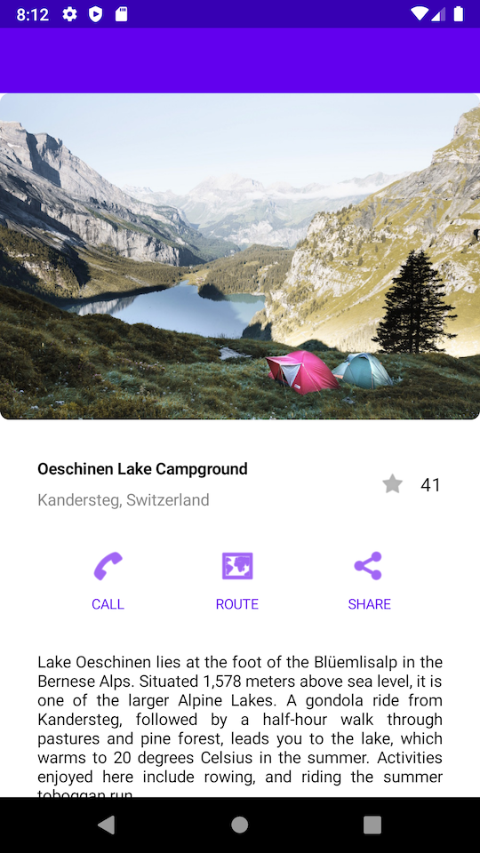

# Jetpack Compose Flutter Tutorial Design Sample

Topics included:

* @Composable
* MaterialTheme
* Scaffold
* topAppBar
* TopAppBar
* bottomAppBar
* BottomAppBar
* Modifier
* Surface
* VerticalScroller
* Column
* Image
* Box
* Row
* Text
* Clickable
* Icon
* @Model